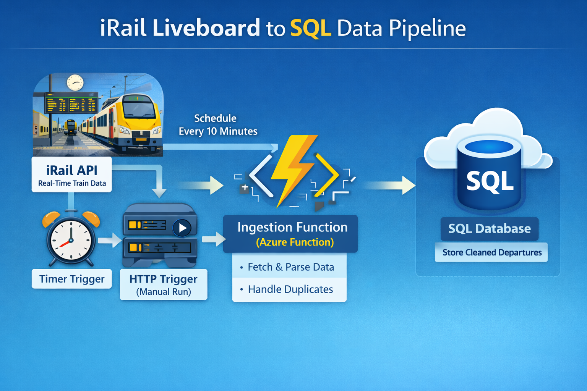
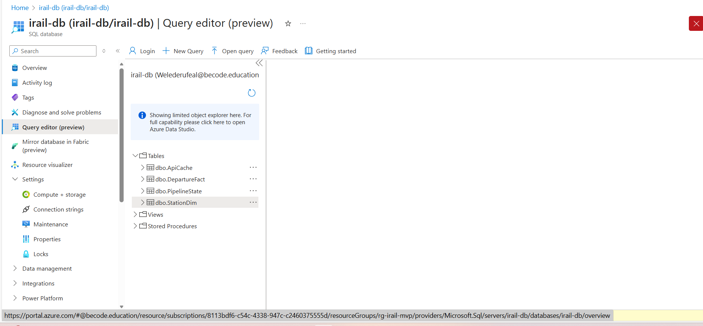

# iRail Azure Pipeline (MVP)

## Project Overview

This project builds a simple cloud data pipeline on Microsoft Azure that fetches live train departure data from the iRail API, normalizes it, and stores it in an Azure SQL Database.

## Tech Stack

- **Language:** Python 3.10  

- **Cloud:** Microsoft Azure (Functions, SQL Database, SQL Server)  
- **API:** iRail (REST/JSON)  
- **Orchestration:** Trigger-based (MVP) / Timer-based 

## System Architecture

<p align="center">
  
</p>

## Project overview

This project builds a simple cloud data pipeline on Microsoft Azure that:

- Fetches live train departure data from the iRail API (Belgium)
- Normalizes the response into structured fields
- Stores the data in an Azure SQL Database
- Runs ingestion using an Azure Function (Python)
# Repo structure

``` bash 
Irail-db
├── .venv/
├── .vscode/
├── assets/
├── .funcignore
├── .gitignore
├── function_app.py
├── host.json
├── local.settings.json
├── README.md
└── requirements.txt
```

## 🛠️ System Requirements & Infrastructure

### 1. Cloud Infrastructure (Azure)

This project is built using an **Azure for Students** subscription. The following resources must be provisioned:
* **Azure SQL Database:** Serverless tier (e.g., `rg-irail-mvp`) to store station and departure data.
* **Azure Function App:** Python 3.10 runtime to host the ingestion logic.
* **Storage Account:** Required for Azure Function state management.

### 2. Local Development Environment

To modify or deploy this project locally, you need:
* **Python 3.10/3.11:** To ensure compatibility with Azure runtimes.
* **Azure Functions Core Tools v4:** For local debugging and deployment.
* **ODBC Driver 18 for SQL Server:** Necessary for `pyodbc` to connect to the cloud database.
* **VS Code Extensions:** Azure Functions & Azure Account.

### 3. Python Dependencies

The following packages are required and managed via `requirements.txt`:
| Package | Purpose |
| :--- | :--- |
| `azure-functions` | Core framework |
| `requests` | iRail API communication |
| `pyodbc` | SQL Server database connectivity |

## Data Modeling

The database is designed using a **Star Schema** approach. This structure was chosen to follow industry best practices for analytical data, separating business **events** (facts) from descriptive **entities** (dimensions).

<center>

### 🌟 STAR SCHEMA STRUCTURE

</center>

                        

    ┌──────────────────────────┐             ┌────────────────────────┐
    │     dbo.StationDim       │             │    dbo.DepartureFact   │
    ├──────────────────────────┤             ├────────────────────────┤
    │ station_id (PK)  ────────┼───┐         │ id (PK)                │
    │ name                     │   └────────>│ station_id (FK)        │
    │ longitude                │             │ scheduled_time_utc     │
    │ latitude                 │             │ delay_seconds          │
    │ last_updated_utc         │             │ is_delayed             │
    └──────────────────────────┘             │ is_cancelled           │
                                             │ vehicle_id             │
                                             │ train_type             │
    ┌──────────────────────────┐             │ destination_name       │
    │     dbo.ApiCache         │             │ created_at_utc         │
    ├──────────────────────────┤             └────────────────────────┘
    │ cache_key (PK)           │
    │ etag                     │
    │ updated_at_utc           │
    └──────────────────────────┘


    ┌──────────────────────────┐
    │    dbo.PipelineState     │
    ├──────────────────────────┤
    │ state_key (PK)           │
    │ state_value              │
    │ updated_at_utc           │
    └──────────────────────────┘


---

<div align="center">
  
  
</div>

<p align="center">
  <em>Figure 1: Table model view in Power bi (Left) and Tables list in Azure DB(Right)</em>
</p> 

### 1. dbo.DepartureFact (Fact Table)

This table stores **every individual train departure** collected from the iRail liveboard API.  
It is the **source of truth** for all delay, punctuality, and traffic analysis.

Main fields:

- `scheduled_time_utc` – planned departure time
- `delay_seconds` – delay in seconds (0 if on time)
- `is_delayed` – flag derived from delay
- `realtime_time_utc` – scheduled time + delay
- `is_cancelled` – cancellation flag when available
- `station_name`, `station_id`
- `destination_name`, `destination_id`
- `vehicle_id`, `train_type`, `platform`
- `ingested_at_utc` – ingestion timestamp

**Purpose**

- Analyze delays and cancellations
- Measure train traffic over time
- Serve as the main dataset for dashboards and ML features

**Characteristics**

- High volume (rows grow continuously)
- Append-only ingestion
- Deduplication enforced via a natural key
- Time-based analysis friendly (UTC timestamps)

**Example metrics derived from this table**

- Average delay per station
- Delay rate by hour/day
- Cancelled vs on-time trains
- Peak-hour congestion

---

### 2. dbo.StationDim (Dimension Table)

This table stores **static metadata about Belgian railway stations**.

**Purpose**

- Provide geographic and descriptive context
- Enable joins for analysis and visualization
- Avoid duplication of station attributes in the fact table

**Usage**

- Can be joined to `DepartureFact` in Power BI to be Used for maps, station-level aggregation, and filtering

## 3. dbo.ApiCache & dbo.PipelineState (Utility Tables)

These tables manage the **intelligence** of the pipeline.

- **ApiCache**  
  Stores ETags for each station. This prevents the pipeline from inserting duplicate data if the iRail board hasn’t updated since the last check.

- **PipelineState**  
  Stores the Batch Offset. This acts as a *bookmark* so the Azure Function knows where to start its next 10-minute cycle through the 700+ Belgian stations.

## Azure Function logic

The data ingestion is implemented using Azure Functions (Python).

### FetchLiveboardToSql

- Trigger: HTTP request
- Calls the iRail `/liveboard` API for a given station
- Parses the JSON response
- Normalizes relevant fields (time, delay, platform, train type, etc.)
- Inserts new departure records into the `DepartureFact` table
- Uses environment variables for database credentials
- Handles basic rate limits and transient errors

### LoadStations

- Trigger: HTTP request
- Calls the iRail `/stations` API
- Extracts station metadata and coordinate
- Upserts station records into the `StationDim` table
- Intended to be run and update once per week on sunday 3:00 AM (station data changes rarely)

## Configuration and environment variables

Sensitive information and configuration values are not hardcoded in the source code.

They are stored as **Application Settings** in the Azure Function App.

Main environment variables:

- `SQL_SERVER` – Azure SQL Server hostname
- `SQL_DATABASE` – Database name
- `SQL_USERNAME` – SQL admin login
- `SQL_PASSWORD` – SQL admin password
- `IRAIL_STATION` – Default station for liveboard requests(option to test one station)
- `IRAIL_LANG` – Language for iRail responses(en/nl/fr/de)
- `IRAIL_USER_AGENT` – User-Agent string recommended by iRail API
- `IRAIL_BATCH_SIZE`- Number of stations to process per run respecting iRail "Fair Use" policy
- `SqlConnectionString`- The secure credential used by the Python runtimeto connect to the Azure SQL Database instance
- `IRAIL_RPS`- Requests Per Second. Limits the speed of API calls(2) to prevent IP rate-limit

## Testing the pipeline

### Cloud testing (Azure Portal)

<p align="center">
  
</p>

- Functions were tested directly in Azure using **Code + Test**
- This ensured the code ran in the same environment as production

For this project, cloud-based testing was preferred once the core logic was stable.

## Current status and next steps

**Real-Time Analytical Layer:** Architected a live connection between **Power BI** and **Azure SQL** using **DirectQuery** to reflect the current network health (OTP, Moderate, and Major delays) as the examples show below.

<div align="center">
  
  
</div>

<p align="center">
  <em>Figure 1: On -time performance (Left) and Average delay distribution per departure time(Right)</em>
</p>

## 🏆 Project Milestones

The following core features are fully implemented and running in production:

[x] Automated Data Ingestion: Configured a Timer Trigger that executes every 10 minutes to pull live train data from the iRail API.

[x] Relational Persistence: Data is successfully structured and stored in Azure SQL Database using optimized tables for performance.

[x] Geographic Metadata: All departures are mapped to geographic coordinates (Longitude/Latitude) for spatial analysis and updates once per week.

[x] Scalable Ingestion: Implemented IRAIL_BATCH_SIZE and PipelineState to ensure the entire Belgian rail network is covered efficiently without hitting API limits.

[x] Live Business Intelligence: Connected Power BI to Azure SQL via DirectQuery, enabling live dashboard updates and real-time visualization of network health (OTP, Moderate, and Major delays).

## 👥 Contributors

This project is part of AI & Data Science Bootcamp training at **</becode** and it was done by: 

- Welederufeal Tadege [LinkedIn](https://www.linkedin.com/in/) | [Github](https://github.com/welde2001-bot) 
